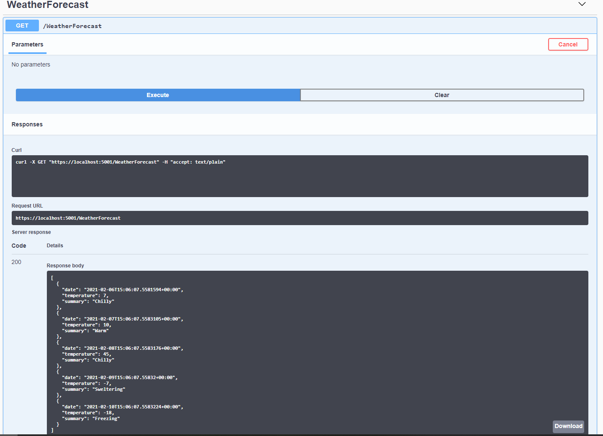
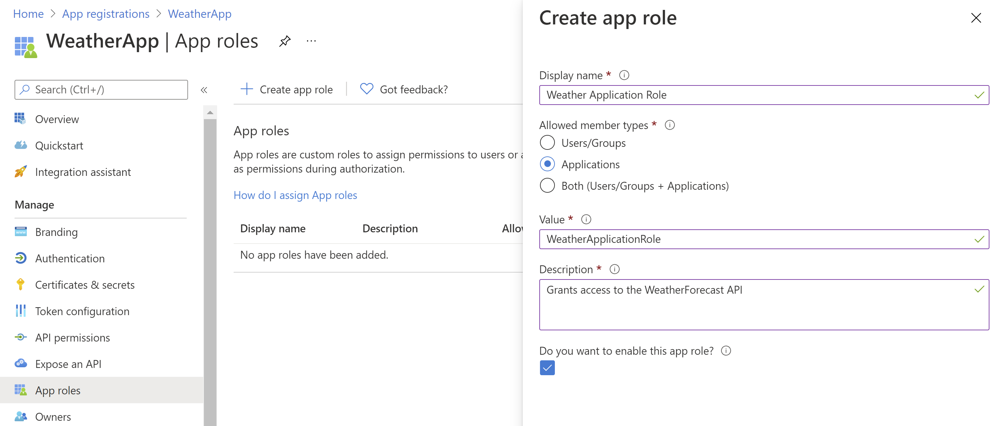
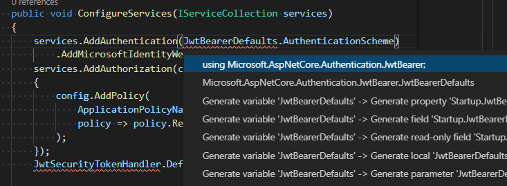
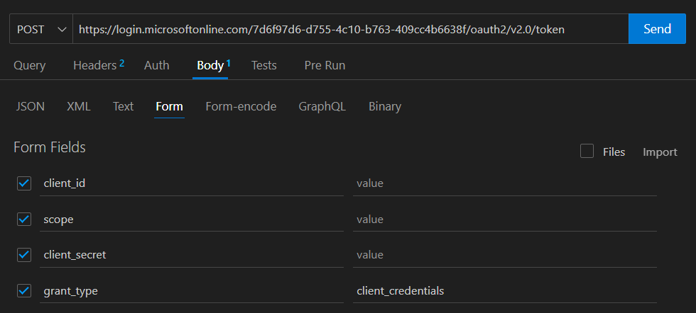
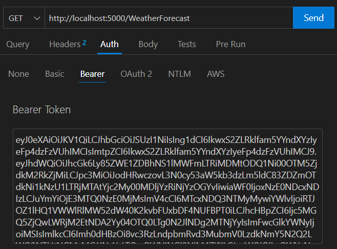

# Implementing OAuth

If you haven't completed the prerequisites in the [README](./README.md) do so now.

## Part 1 - Protected web API

We want to create a web API which is protected by [Microsoft Entra authentication](https://docs.microsoft.com/en-us/azure/active-directory/authentication/overview-authentication#:~:text=One%20of%20the%20main%20features,of%20a%20username%20and%20password.).
That means it shouldn't be possible to access the api without a valid authentication token. We'll use Azure services to generate and verify the token. Specifically, we will be using the OAuth2 ["client credentials"](https://docs.microsoft.com/en-us/azure/active-directory/develop/v2-oauth2-client-creds-grant-flow) flow, useful for server-to-server interaction.

### 1.1: Set up the web API

This repository contains code for a simple .NET Core web API.
It exposes one GET endpoint, WeatherForecast, which will return a randomly generated weather forecast for the next five days.

You don't need to worry too much about what the code is doing for now. However, you should be able to build and run the app.

To run the application, run `dotnet build` and then `dotnet run` from a terminal in the `WeatherForecast` folder.

You should now be able to visit <http://localhost:5000/swagger/index.html> in a browser. This loads a [Swagger UI](https://swagger.io/tools/swagger-ui/) page.
> If you are using GitHub Codespaces you will need to add `swagger/index.html` to the browser URL when forwarding port 5000

Swagger UI is a useful tool to test API endpoints. To test this API click the "/WeatherForecast" row then "Try it out" then "Execute". You should then be able to see the response from the endpoint.



### 1.2: Create an app registration for a protected web API

The next step is to create an app registration for the web API we're going to use. We need to do this so that we can verify the authentication token sent to our API is valid. To do this we register our application within Azure as a protected web API.

In particular we want to configure it so that the data provided by the API can be consumed by another app securely using tokens, without needing a user to log in first.

Here are the steps for setting up the web API application in Azure:

1. Create a new app registration (from [this page on Azure](https://go.microsoft.com/fwlink/?linkid=2083908)).
     * Use `Weather App - <Your Initials>` as the app name and leave **Supported account types** on the default setting of **Accounts in this organizational directory only**.
2. After registering, expand **Manage** from the left menu, then click **Expose an api** and on **Application ID URI**, click on **Add**. Keep the suggested value, for example `api://<web api client id>`
3. Create an app role as follows:


### 1.3: Add authentication to a web API

Now we need to add some code to our API so that it will only allow requests with the correct authentication.

**Add the Microsoft Entra config from the app registration to the app.**

This should be provided in the `appsettings.json` file. Update this file to include the following information:

```json
{
  "AzureAd": {
    "Instance": "https://login.microsoftonline.com/",
    "ClientId": "CLIENT_ID",
    "TenantId": "TENANT_ID"
  },
  ...
}
```

You can find the client id and tenant id on the overview page for your app registration in the Azure portal. See [this guide](https://docs.microsoft.com/en-us/azure/active-directory/develop/scenario-protected-web-api-app-configuration#config-file) for more details.

**Configure the app to use authentication.**

These changes need to be made in `Startup.cs`. You need to update the `ConfigureService` method to include the following:

```csharp
public void ConfigureServices(IServiceCollection services)
{
    services.AddAuthentication(JwtBearerDefaults.AuthenticationScheme)
        .AddMicrosoftIdentityWebApi(Configuration.GetSection("AzureAd"));
    services.AddAuthorization(config =>
    {
        config.AddPolicy(
            "ApplicationPolicy",
            policy => policy.RequireClaim(ClaimConstants.Roles, "WeatherApplicationRole")
        );
    });
    JwtSecurityTokenHandler.DefaultMapInboundClaims = false;

    ...
}
```

> Note that the role name must **precisely** match the role that you created on your App Registration.

You will also need to import the relevant libraries. VSCode can fix this for you automatically if you click on the missing import (highlighted in red) and then press Ctrl/Cmd + FullStop.

If you are having issues with VSCode's autoimport, you can manually add the imports to the top of the file:

```csharp
using System.IdentityModel.Tokens.Jwt;
using Microsoft.AspNetCore.Authentication.JwtBearer;
using Microsoft.Identity.Web;
```



This sets up the authentication using the config values from appsettings.json (passed in through the IConfiguration object).

You also need to update the `Configure` method so that it adds authentication and authorization to the app, between the existing `app.UseRouting` and `app.UseEndpoints` lines:

```csharp
public void Configure(IApplicationBuilder app, IWebHostEnvironment env)
{
    ...
    app.UseRouting();

    app.UseAuthentication();
    app.UseAuthorization();

    app.UseEndpoints(endpoints =>
    ...
}
```

See [this guide](https://docs.microsoft.com/en-us/azure/active-directory/develop/scenario-protected-web-api-app-configuration#starting-from-an-existing-aspnet-core-31-application) for more details.

**Add authentication to the `/WeatherForecast` endpoint**

You can do this by using the `Authorize` attribute on the class (in `WeatherForecastController.cs`):

```csharp
[Authorize(Policy = "ApplicationPolicy")]
[ApiController]
[Route("[controller]")]
public class WeatherForecastController : ControllerBase
```

Again, an import is needed. If VSCode can't add it, you can manually copy this to the top of the file: `using Microsoft.AspNetCore.Authorization;` 

The name of the policy (`"ApplicationPolicy"` in this case) can be whatever you want but it needs to match the name of the policy you define in the `ConfigureServices` method. Adding the `Authorize` header with that policy will ensure that only a request with a valid token which is for `WeatherApplicationRole` will be able to hit the endpoint.

The API should now be protected. If you try to hit the endpoint again through Swagger UI, you should get a 401 error response. This means that the request has been rejected because you didn't provide the correct authentication.

You'll see in the next part how we can add a valid authentication token to the request.

## Part 2 - Access a protected web API

### 2.1: Create an app registration for a client accessing the web API

You are now going to register a second application - a consumer of the protected API - that will access it by generating an access token. You will play the part of the second application by making HTTP requests yourself. To register it, create a second "app registration" in the Azure portal:

Create a new app registration called `Weather App Consumer - <Your Initials>` (feel free to name it something else if you prefer!).

* Once created, add a new **client secret** from the **Certificates & secrets**. Make a note of the secret's value - you will not be able to access this through the portal later.

Next you'll need to grant API permission for the new application to access the first app registration you created.

* Select **API permissions** => **Add a permission** => **My APIs** then click on your app and the role you created earlier (`WeatherApplicationRole`)
* **To enable that role we will need to grant admin consent: contact your trainer so that they can do this now.** To do this, we will just click the tick icon above the table on the API permissions page, but you will not have permission.
  * While you're waiting for a response,  continue to create the request in Part 2.2. That will succeed once the admin consent has been granted.

### 2.2: Get a token to access the web API

You should now be able to request a token to access the API. See [here](https://docs.microsoft.com/en-us/azure/active-directory/develop/v2-oauth2-client-creds-grant-flow#first-case-access-token-request-with-a-shared-secret) for what the request should look like.

The structure of the request in Thunder Client will look like the following:



In particular:

* It is a POST request to a URL of the form `https://login.microsoftonline.com/your_tenant_id/oauth2/v2.0/token`
* The tenant id should be from the tenant you created in part 1. You can find this on the overview page for either of the app registrations you've created.
* The client id should be for the consumer app, i.e. the app registration you created in step 2.1.
* The client secret value should be the one you created in step 2.1, to prove that it is the application making this request.
* The scope should be the application ID URI of the secured Weather Forecast API, i.e. the app registration you created in step 1.3, followed by "/.default". For example `api://40ae91b7-0c83-4b5c-90f3-40187e8f2cb6/.default`.
  * You can find the application ID URI on the app registration's overview page, or going to the "Expose an API" section.
  * Note that if you are *NOT* using Thunder Client, it needs to be URI encoded. For example `api%3A%2F%2F40ae91b7-0c83-4b5c-90f3-40187e8f2cb6%2F.default`
* The client id, secret, scope and grant type should go in the Body of the request not as URL "Params"

Once you get a successful response copy the access token from it. You're going to use this in the request to your web API.

### 2.3: Send a request to the web API

Now you just need to add the token from the previous step to your request to the API. This can either be done via Swagger or Thunder Client:

### Using Swagger

With the web API running and the Swagger UI page open you should see an "Authorize" button. The button should currently have an unlocked padlock icon on it, which means that no authorization token has been added. Once you click the button a popup should appear where you can enter the token. Make sure to include "Bearer" but don't include quotes. So for example:

```text
Bearer eyJ0eXAiOiJKV1QiLCJ...
```

After you've entered the token click "Authorize". This should close the popup and the "Authorize" button should now have a closed padlock icon on it. When you now send a request through Swagger it should include the token and the request should be accepted.

### Using Thunder Client

Create a GET request with an authorisation type of Bearer:



### Troubleshooting

<details>
  <summary>Expand</summary>

If you have a token, but the WeatherForecast API returns an error, then double check you've copied the token without any quotes and that you're prefixing it with "Bearer " if using Swagger.

If you still get an error then you can inspect the token to determine what's wrong.

* Open <https://jwt.io> in your browser
* Paste the token into the "Encoded" section
* The access token we get from Azure is a JSON Web Token (JWT). It has a header, body and signature. We want to look at the decoded body for a section like

```json
"roles": [
  "WeatherApplicationRole"
]
```

If that section is present, then double check your `client_id` and `scope` parameters are correct, and that the name of the role matches what you have in `WeatherForecast/Startup.cs`.
If that section is missing, then open your Weather App Consumer app registration (the second one) in the Azure Portal. Make sure you've added WeatherApplicationRole as a permission and granted admin consent for it - there should be a green tick in the status column.

</details>

### 2.4: Write a script to send a request to the web API

Instead of having to manually get a token and add it to the request, write a python script to do it for you. The script should:

1. Send a POST request to get a token to access the web API, as you did manually in step 2.2.
2. Use the token to send a GET request to the web API.
3. Print the response from the web API.

NB you might see an error "certificate verify failed" when making the request to the web API from your script. Running `dotnet dev-certs https --trust` in the terminal should fix this, as it should make your machine trust the dev certificates the web API is using. However it doesn't always work and you might not be able to run the command if you don't have admin rights. Another way to fix it is by turning off certificate verification for the request, e.g. by passing in `verify=False` to the `requests.get` method. We wouldn't do this on a deployed app but in this case we'll only be running the script locally.

## (Stretch Goal) Part 3 - Webpage accessing a protected API

We now want to build a simple webpage to show the weather forecast from our API. This webpage should:

1. Prompt the user to log in to their Microsoft account, if they haven't signed in already
2. Get an access token for the web API on behalf of the user
3. Get a weather forecast from the API and display it to the user

This is the OAuth2 "authorization code" flow.

You can build this webpage using whatever language and tech stack you want but we'll focus on Python here.

### 3.1: Create an app registration for the webpage

To enable login and access to the API we need to create yet another app registration in the Azure portal like we did before.

**To configure a Python Flask app for use with the Microsoft Identity Platform you can [start from Microsoft's template repo here](https://github.com/Azure-Samples/ms-identity-python-webapp?tab=readme-ov-file#integrating-microsoft-entra-id-with-a-python-web-application-written-in-flask).**
* In this exercise we only care about the "Microsoft Entra ID" case (ignoring other cases such as Azure B2C, External Entra ID, etc.)
* Note that you when running this example you will need to change the `ENDPOINT` and `SCOPE` environment variables to match your Weather API shortly

Once you've created the app registration and set the redirect URL, you need to give it permission to access the API. You can do this in the same way as for the "Weather App Consumer" app registration used, with a few differences:

1. On your original **API** app registration, go to "Expose an API" and add a scope, named "access_as_user"
2. On your brand new webpage app registration, go to API permissions -> add permission -> my APIs -> select the app registration for your API
3. Select _"delegated permissions"_ instead of "application" which you selected last time. This is because the webpage be accessing the API on behalf of a user, instead of as a daemon application.
4. Make sure you ask an admin to grant admin access like you did for the app registration used in the python script.

Note

### 3.2: Update the web API to allow access by user

Currently our web API is configured to only allow access with a token generated for an application. However we'll be generating a token for a user. Therefore we need to slightly tweak the authorization we've added to the web API.

In particular change the policy to:

```csharp
config.AddPolicy(
    "UserPolicy",
    policy => policy.RequireClaim(ClaimConstants.Scp, "access_as_user")
);
```

And update the policy name the `WeatherForecastController` uses:

```csharp
[Authorize(Policy = "UserPolicy")]
[ApiController]
[Route("[controller]")]
public class WeatherForecastController : ControllerBase
```

If you want to still be able to access the API from your script you can add a new policy instead of changing the existing one (so add the `config.AddPolicy` statement above but also keep the existing `config.AddPolicy` statement). Then you can just change which policy the `WeatherForecastController` uses if you want to access it from your script or from swagger.

You could also change the policy so it will allow access by an application and by a user. The syntax for this is a bit more complicated as you need to check that the token either has a scope claim set to "access_as_user" or a roles claim set to "access_as_application". To do that you need to use `policy.RequireAssertion` instead of `policy.RequireClaim`, see [this doc](https://docs.microsoft.com/en-us/aspnet/core/security/authorization/policies?view=aspnetcore-5.0#use-a-func-to-fulfill-a-policy) for more details.

### 3.3: Get a weather forecast from the API

Now you should be able to make a request to the API from your webpage. So instead of displaying the token once login has succeeded, use the token to make a GET request to the WeatherForecast API endpoint. This will be similar to what you did in the python script for the client credentials flow.

Then display the weather forecast to the user.
